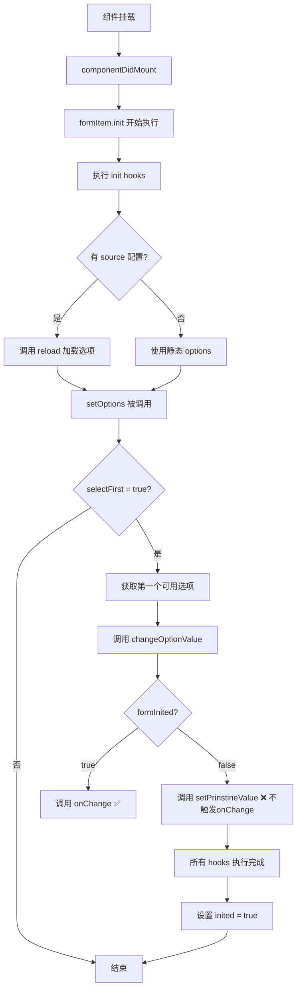

# Select 组件 selectFirst 事件问题调查报告

## 📋 问题概述

当 select 组件配置 `selectFirst: true` 后：
1. ❌ 第一项虽然被自动选中，但**不会触发 onChange 事件**
2. ❌ 组件的 **inited 事件也未被触发**

## 🔍 调查结论

### 结论 1: onChange 不触发是**框架的预期行为**

这**不是 Bug**，而是框架的设计决策。原因如下：

#### 设计理念
- **初始化阶段** 的值设置应该使用 `setPrinstineValue`（设置初始值）
- **用户交互** 或 **外部数据变化** 才应该触发 `onChange`（触发业务逻辑）
- 避免在组件初始化时误触发不必要的业务逻辑

#### 代码证据

**位置**: `/packages/amis-core/src/renderers/Options.tsx` 第 898-911 行

```typescript
@autobind
changeOptionValue(value: any) {
  const {onChange, formInited, setPrinstineValue, value: originValue} = this.props;

  if (formInited === false) {
    // ⚠️ 表单未初始化时，调用 setPrinstineValue，不触发 onChange
    originValue === undefined && setPrinstineValue?.(value);
  } else {
    // ✅ 只有表单已初始化时，才触发 onChange
    onChange?.(value);
  }
}
```

#### 执行流程



### 结论 2: FormItem 层面没有 inited 事件

#### 事实说明

1. **formItem.inited** 只是一个内部状态标志位，不是可监听的事件
2. **普通表单项（FormItem）** 没有提供 `inited` 事件的派发机制
3. 只有 **Form** 和 **Service** 等容器级组件才有 `inited` 事件

#### 代码证据

**位置**: `/packages/amis-core/src/store/formItem.ts` 第 1577-1590 行

```typescript
const init: () => Promise<void> = flow(function* init() {
  const hooks = initHooks.sort((a: any, b: any) => (a.__weight || 0) - (b.__weight || 0));
  try {
    for (let hook of hooks) {
      yield hook(self);
    }
  } finally {
    if (isAlive(self)) {
      self.inited = true;  // ⚠️ 只是设置标志位，没有派发事件
    }
  }
});
```

#### 对比其他组件

| 组件类型 | 是否有 inited 事件 | 文件位置 |
|---------|-------------------|---------|
| Form | ✅ 有 | `/packages/amis/src/renderers/Form.tsx` |
| Service | ✅ 有 | `/packages/amis/src/renderers/Service.tsx` |
| Wizard | ✅ 有 | `/packages/amis/src/renderers/Wizard.tsx` |
| Select (FormItem) | ❌ 无 | - |
| Input (FormItem) | ❌ 无 | - |

## 💡 解决方案

### 方案一：使用 loadOptionsFinished 事件（推荐 ⭐）

**适用场景**: 需要在选项加载完成后执行操作

```json
{
  "type": "select",
  "name": "mySelect",
  "label": "选择器",
  "selectFirst": true,
  "source": "/api/options",
  "onEvent": {
    "loadOptionsFinished": {
      "actions": [
        {
          "actionType": "toast",
          "args": {
            "msgType": "success",
            "msg": "选项已加载，自动选中: ${items[0].label}"
          }
        }
      ]
    }
  }
}
```

**优点**:
- ✅ 框架原生支持
- ✅ 明确表示选项加载完成
- ✅ 可以获取到选项数据

### 方案二：使用 Form 的 inited 事件

**适用场景**: 需要在整个表单初始化完成后执行操作

```json
{
  "type": "form",
  "onEvent": {
    "inited": {
      "actions": [
        {
          "actionType": "custom",
          "script": "console.log('表单初始化完成，select已自动选中:', event.data.mySelect)"
        }
      ]
    }
  },
  "body": [
    {
      "type": "select",
      "name": "mySelect",
      "selectFirst": true,
      "options": [
        {"label": "选项A", "value": "a"},
        {"label": "选项B", "value": "b"}
      ]
    }
  ]
}
```

**优点**:
- ✅ 可以确保所有表单项都已初始化
- ✅ 可以访问所有表单项的初始值
- ✅ 适合需要基于多个字段的初始化逻辑

### 方案三：通过 loadOptionsFinished 触发值变更

**适用场景**: 确实需要模拟 onChange 行为

```json
{
  "type": "select",
  "name": "mySelect",
  "label": "选择器",
  "selectFirst": true,
  "source": "/api/options",
  "onEvent": {
    "loadOptionsFinished": {
      "actions": [
        {
          "actionType": "setValue",
          "componentId": "mySelect",
          "args": {
            "value": "${items[0].value}"
          }
        }
      ]
    },
    "change": {
      "actions": [
        {
          "actionType": "toast",
          "args": {
            "msg": "值已改变: ${event.data.value}"
          }
        }
      ]
    }
  }
}
```

**说明**:
- ⚠️ 这种方式会触发两次值设置（selectFirst + setValue）
- ⚠️ 可能会导致不必要的重复操作
- ✅ 但可以确保 change 事件被触发

### 方案四：不使用 selectFirst，手动设置默认值

**适用场景**: 需要完全控制初始化行为

```json
{
  "type": "select",
  "name": "mySelect",
  "label": "选择器",
  "source": "/api/options",
  "onEvent": {
    "loadOptionsFinished": {
      "actions": [
        {
          "actionType": "custom",
          "script": "if (!event.data.value && event.data.items.length > 0) { doAction({actionType: 'setValue', componentId: 'mySelect', args: {value: event.data.items[0].value}}); }"
        }
      ]
    },
    "change": {
      "actions": [
        {
          "actionType": "toast",
          "args": {
            "msg": "值已改变: ${event.data.value}"
          }
        }
      ]
    }
  }
}
```

**优点**:
- ✅ 完全可控
- ✅ 可以添加自定义条件判断
- ✅ change 事件正常触发

**缺点**:
- ❌ 代码较复杂
- ❌ 需要手动维护逻辑

## 📚 核心源码位置

| 功能 | 文件路径 | 行号 | 说明 |
|------|---------|------|------|
| selectFirst 实现 | `/packages/amis-core/src/store/formItem.ts` | 685-713 | setOptions 方法中的 selectFirst 逻辑 |
| changeOptionValue | `/packages/amis-core/src/renderers/Options.tsx` | 898-911 | 判断是否触发 onChange |
| init hooks 执行 | `/packages/amis-core/src/store/formItem.ts` | 1577-1590 | 初始化流程和 inited 标志设置 |
| 选项加载 | `/packages/amis-core/src/renderers/Options.tsx` | 383-397 | addInitHook 添加选项加载逻辑 |
| loadOptionsFinished | `/packages/amis-core/src/renderers/Options.tsx` | 419-439 | 派发 loadOptionsFinished 事件 |

## 🎯 最佳实践建议

### ✅ DO (推荐做法)

1. **使用正确的事件监听点**
   ```javascript
   // ✅ 好的做法
   {
     "onEvent": {
       "loadOptionsFinished": { /* 选项加载完成时 */ },
       "change": { /* 用户操作时 */ }
     }
   }
   ```

2. **理解初始化和用户交互的区别**
   - 初始化 = 设置表单的初始状态（不应触发业务逻辑）
   - 用户交互 = 响应用户的操作（应触发业务逻辑）

3. **在 Form 级别监听整体初始化**
   ```javascript
   // ✅ 需要所有字段都初始化完成时
   {
     "type": "form",
     "onEvent": {
       "inited": { /* 整个表单初始化完成 */ }
     }
   }
   ```

### ❌ DON'T (不推荐做法)

1. **❌ 依赖 selectFirst 触发业务逻辑**
   ```javascript
   // ❌ 错误的期望
   {
     "selectFirst": true,
     "onEvent": {
       "change": {
         "actions": [
           {"actionType": "ajax", "api": "/api/xxx"}  // 期望初始化时调用，但不会触发
         ]
       }
     }
   }
   ```

2. **❌ 期望 FormItem 有 inited 事件**
   ```javascript
   // ❌ 不存在的事件
   {
     "type": "select",
     "onEvent": {
       "inited": { /* FormItem 没有这个事件 */ }
     }
   }
   ```

3. **❌ 在初始化阶段执行副作用操作**
   ```javascript
   // ❌ 应该在 change 事件中执行，而不是依赖 selectFirst
   {
     "selectFirst": true,
     // 期望初始化时就发送请求 - 不会发生
   }
   ```

## 🔧 是否需要修改框架？

### 不建议修改的理由

1. **破坏现有契约**: 很多现有应用依赖于"初始化不触发 onChange"的行为
2. **可能引入 Bug**: 可能导致重复执行业务逻辑
3. **已有替代方案**: `loadOptionsFinished` 事件已经满足需求
4. **设计合理**: 当前设计清晰区分了初始化和用户交互

### 如果确实需要修改

可以考虑添加一个新的配置项，而不是改变默认行为：

```typescript
// 新增配置项建议
{
  type: 'select',
  selectFirst: true,
  selectFirstTriggerChange: true,  // 新增: 是否在 selectFirst 时触发 change
  // ...
}
```

这样可以：
- ✅ 保持向后兼容
- ✅ 给需要的用户提供选择
- ✅ 不影响现有应用

## 📊 时序图

完整的初始化时序：

```
组件创建
    ↓
构造函数执行
    ↓
添加 init hooks (包括选项加载)
    ↓
componentDidMount
    ↓
formItem.init() 开始
    ↓
    ┌─────────────────────┐
    │ 执行 init hooks     │
    │  ↓                  │
    │ reload (如果有API)  │
    │  ↓                  │
    │ setOptions          │
    │  ↓                  │
    │ selectFirst 逻辑    │
    │  ↓                  │
    │ changeOptionValue   │
    │  ↓                  │
    │ formInited = false? │
    │  ↓ YES              │
    │ setPrinstineValue   │ ← 不触发 onChange
    └─────────────────────┘
    ↓
所有 hooks 完成
    ↓
inited = true (内部标志)
    ↓
派发 loadOptionsFinished 事件  ← 可以监听这个
    ↓
派发 Form.inited 事件           ← 或者监听这个
    ↓
组件可响应用户交互
    ↓
用户选择
    ↓
触发 change 事件                ← 这时候会触发
```

## 🧪 验证方法

创建一个简单的测试页面，打开浏览器控制台观察：

```html
<script>
let amis = amisRequire('amis/embed');

amis.embed('#root', {
  type: 'form',
  debug: true,
  onEvent: {
    inited: {
      actions: [{
        actionType: 'custom',
        script: 'console.log("✅ Form inited 触发", event.data)'
      }]
    }
  },
  body: [{
    type: 'select',
    name: 'test',
    label: '测试',
    selectFirst: true,
    options: [{label: 'A', value: 'a'}, {label: 'B', value: 'b'}],
    onEvent: {
      change: {
        actions: [{
          actionType: 'custom',
          script: 'console.log("❌ 这个不会在初始化时触发", event.data.value)'
        }]
      },
      loadOptionsFinished: {
        actions: [{
          actionType: 'custom',
          script: 'console.log("✅ LoadOptionsFinished 触发", event.data)'
        }]
      }
    }
  }]
});
</script>
```

**预期控制台输出**:
```
✅ Form inited 触发 {test: "a"}
✅ LoadOptionsFinished 触发 {options: [...], value: "a"}
(❌ change 事件不会出现)
```

## 📝 总结

| 问题 | 结论 | 解决方案 |
|------|------|----------|
| selectFirst 不触发 onChange | ✅ 这是预期行为 | 使用 `loadOptionsFinished` 或 `form.inited` 事件 |
| FormItem 没有 inited 事件 | ✅ 框架设计如此 | 监听 Form 级别的 `inited` 事件 |
| 如何在初始化时执行逻辑 | ✅ 有多种方案 | 见上面的"解决方案"章节 |
| 是否应该修改框架 | ❌ 不建议 | 当前设计合理，已有足够的替代方案 |

**最重要的理解**:
- `selectFirst` 的目的是**设置初始值**，不是**触发业务逻辑**
- 初始化和用户交互是两个不同的阶段，应该使用不同的事件来响应
- 框架提供了足够的事件钩子（`loadOptionsFinished`, `form.inited`）来满足各种需求
